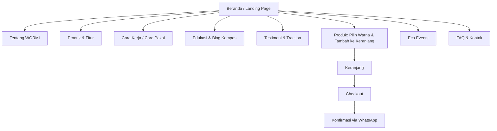
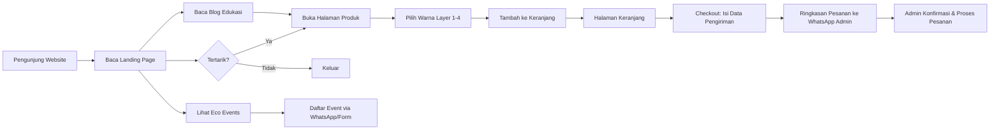

# Product Requirements Document (PRD)
# Website MVP — WORMI Eco Solutions
### *Inovasi Komposter Mini Berbasis Pengolahan Sampah Organik untuk Rumah Tangga*

| | |
|---|---|
| **Dokumen** | PRD Website MVP |
| **Produk fisik terkait** | Cacing Kompos (WORMI) — komposter dapur mini bertingkat |
| **Tujuan** | Materi pendukung *Business Plan Competition* (GPE 2026) |
| **Status** | Draft v1.0 |
| **Tanggal** | September 2026 |

---

## 1. Latar Belakang

Sampah rumah tangga menyumbang **±56,7%** dari total timbulan sampah nasional, dan sisa makanan mendominasi **39–41%** dari jumlah tersebut. Solusi pengomposan konvensional (mis. keranjang Takakura, komposter ember tumpuk) umumnya dirancang untuk rumah dengan halaman, sehingga tidak menjawab kebutuhan penghuni kos, kontrakan petak, dan apartemen studio — kelompok dengan mobilitas tinggi dan lahan terbatas, termasuk lebih dari 10,7 juta mahasiswa aktif di Indonesia.

**WORMI** menjawab masalah ini dengan komposter dapur mini berkarakter cacing: bertingkat, berventilasi, bebas bau, dan dilengkapi keran penampung air lindi, sehingga bisa dipakai di ruang sekecil kamar kos.

Website MVP ini dibuat sebagai **kanal digital utama** WORMI untuk perlombaan business plan: memperkenalkan produk, mengedukasi cara pakai, mengumpulkan minat pembeli (leads/pre-order), dan menjadi bukti *traction* awal (data pengguna, testimoni, repeat order) yang mendukung proyeksi bisnis di proposal.

---

## 2. Tujuan Produk (Goals)

1. Menjadi **etalase digital** WORMI yang menjelaskan masalah, solusi, fitur, dan cara pakai produk secara ringkas dan meyakinkan juri/investor.
2. Memfasilitasi **pemesanan/pre-order** dan penangkapan **leads** (nama, kontak, domisili kos/apartemen) tanpa perlu sistem pembayaran kompleks.
3. Menjadi media **edukasi** pengomposan mandiri (artikel, FAQ, panduan) untuk membangun kepercayaan dan mengurangi pertanyaan berulang.
4. Mendorong keterlibatan komunitas melalui informasi **Eco Events** (acara keberlanjutan lingkungan) yang mendukung citra brand dan *word of mouth*.
5. Bisa didemokan secara langsung di sesi presentasi lomba (cepat diakses, responsif di HP juri).

### Non-Goals (di luar cakupan MVP)
- Sistem pembayaran online (payment gateway) — closing transaksi tetap lewat WhatsApp untuk sementara (lihat justifikasi di Bagian 3.1).
- Dashboard/pencatatan mandiri progres kompos pengguna — dihapus dari cakupan MVP; konsekuensinya, data seperti "jumlah kompos dihasilkan" diperoleh lewat survei manual, bukan otomatis (lihat Bagian 3.2).
- Aplikasi mobile native.
- Sistem logistik/pengiriman terintegrasi (ongkir otomatis).
- Multi-bahasa (cukup Bahasa Indonesia).

---

## 3. Strategi MVP & Antisipasi Pertanyaan Kritis

Beberapa keputusan desain di PRD ini sengaja dibuat "tidak lengkap secara teknis" pada tahap MVP. Bagian ini menjelaskan *mengapa*, agar tidak terlihat sebagai kelemahan saat dipresentasikan ke juri.

### 3.1 "Kalau ujungnya tetap konfirmasi via WhatsApp, untuk apa dibangun website dengan keranjang & checkout?"

Ini pertanyaan paling mendasar dan **harus dijawab eksplisit di pitch**. Jawabannya bukan "website menggantikan WA", tapi **website menggantikan proses yang selama ini paling tidak efisien** dalam order manual: menjelaskan produk berulang kali, mengetik ukuran/warna/harga satu per satu, dan mencatat pesanan secara tidak terstruktur di chat.

Peran masing-masing kanal dibagi secara sengaja:

| Yang dikerjakan Website | Yang dikerjakan WhatsApp |
|---|---|
| Edukasi produk & cara pakai (idealnya mengurangi pertanyaan berulang) | Konfirmasi ketersediaan stok & ongkos kirim aktual |
| Konfigurasi produk (pilih warna, jumlah) → data terstruktur | Kesepakatan metode pengiriman & waktu |
| Menyusun ringkasan pesanan otomatis (nama, kontak, alamat, konfigurasi, subtotal) | Sentuhan personal untuk membangun kepercayaan pembeli baru (penting untuk brand baru tanpa rekam jejak) |
| Menyimpan data leads untuk analitik & tindak lanjut pemasaran | — |

Model ini dikenal sebagai **"Concierge/Wizard-of-Oz MVP"**: bagian yang bisa diotomasi (katalog, konfigurasi, kalkulasi, capture data) dibangun di web; bagian yang butuh keputusan manual manusia (verifikasi ongkir, kesepakatan pembayaran, kepercayaan personal) sengaja belum diotomasi karena volume transaksi masih kecil dan biaya membangun payment gateway + sistem logistik penuh **tidak sebanding** dengan tahap validasi pasar saat ini. Pola ini juga dipakai oleh mayoritas UMKM D2C Indonesia (checkout katalog di Instagram/website → closing di WhatsApp), sehingga bukan kekurangan, melainkan pilihan strategis yang sesuai tahapan bisnis (lihat *Ketentuan Persentase Maksimal Komponen Pendanaan* pada proposal, di mana dana tahap awal diprioritaskan untuk riset & produksi, bukan infrastruktur digital penuh).

**Roadmap lanjutan (di luar MVP)**: integrasi payment gateway (Midtrans/Xendit) dan ongkir otomatis (RajaOngkir) begitu volume pesanan sudah stabil dan dapat divalidasi lewat data leads dari MVP ini.

### 3.2 "Kalau produk belum diproduksi massal, dari mana data testimoni & traction di website?"

Menampilkan testimoni palsu atau angka traksi karangan berisiko merusak kredibilitas di depan juri. Maka:
- Data traction yang ditampilkan **wajib** berasal dari uji coba nyata skala kecil (mis. 15–30 pengguna pilot di lingkungan kos sekitar kampus, sesuai target pasar awal di proposal), bukan simulasi.
- Bila belum ada data nyata saat presentasi, tabel/tabel proyeksi (seperti proyeksi *Customer Repeat Rate* di proposal) **wajib diberi label "Proyeksi/Estimasi"** secara eksplisit di halaman, bukan disandingkan seolah data aktual.
- Karena fitur dashboard pencatatan mandiri tidak lagi ada di MVP ini (lihat Non-Goals), data seperti "jumlah kompos yang dihasilkan" hanya bisa didapat lewat **survei tindak lanjut manual** (WA/Google Form ke pembeli pilot 3–4 minggu setelah pembelian), bukan otomatis dari sistem. Ini perlu dicatat sebagai proses operasional tim, bukan fitur teknis website.

### 3.3 "Kustomisasi warna per layer — realistis untuk startup tahap awal dan konsisten dengan identitas karakter cacing yang sudah dibangun?"

Karakter visual WORMI (bentuk cacing lucu, warna terracotta konsisten) adalah aset brand yang sudah kuat di materi produk; kustomisasi warna bebas berisiko merusak identitas ini dan menambah kompleksitas produksi (mis. cetakan/pewarnaan) yang tidak sebanding dengan anggaran tahap awal (produksi hanya dialokasikan maksimum 50% dana pada tahap awal, sesuai proposal). Maka kustomisasi **dibatasi**, bukan bebas:
- Sediakan **3–4 palet warna kurasi** (mis. Terracotta Klasik, Hijau Lumut, Krem Tanah, Abu Arang) yang tetap mempertahankan kesan hangat & playful karakter cacing.
- Warna hanya berlaku untuk **komponen eksterior tiap layer**, bukan mengubah bentuk/karakter wajah produk.
- Pada MVP, opsi warna berfungsi ganda: (1) *fitur personalisasi* untuk pembeli, dan (2) **validasi preferensi warna** — data pilihan warna dari pengunjung dipakai tim untuk menentukan prioritas warna yang benar-benar diproduksi lebih dulu, sehingga produksi tidak asal tebak.

### 3.4 "Kenapa perlu 'keranjang' kalau produknya cuma satu jenis?"

Keranjang tetap relevan karena skenario pembelian realistis: satu pembeli bisa memesan **lebih dari satu unit dengan warna berbeda** (mis. untuk dipakai sendiri + dihadiahkan ke teman kos), atau membeli unit utama bersama produk pelengkap (mis. starter media kompos/bioaktivator) di masa depan. Tanpa keranjang, kombinasi ini sulit dicatat rapi hanya lewat form tunggal.

### 3.5 "Mengelola Eco Events menambah beban operasional startup kecil — apakah realistis?"

Agar tidak membebani tim yang masih kecil, WORMI **tidak wajib menjadi penyelenggara** semua acara. Halaman Eco Events berfungsi sebagai:
1. **Kurator** — menampilkan/menautkan acara lingkungan pihak lain (komunitas zero-waste, kampus, pemerintah kota) yang relevan bagi target pasar, dan
2. **Penyelenggara** hanya untuk acara skala kecil yang murah dijalankan (mis. workshop kompos daring/gratis di area kos), bukan acara besar.

Pembagian ini menjaga fitur tetap bernilai untuk *brand building* dan akuisisi pengguna tanpa menuntut sumber daya operasional besar di tahap MVP.

---

## 4. Target Pengguna & Persona

| Persona | Deskripsi | Kebutuhan Utama |
|---|---|---|
| **Mahasiswa/anak kos** (primer) | Tinggal di kos sekitar kampus (mis. area Bojongsoang), lahan terbatas, peduli lingkungan tapi belum tahu cara mulai kompos | Produk kecil, tidak bau, murah, mudah dipakai |
| **Penghuni apartemen/kontrakan petak** | Keluarga muda/pekerja urban, ingin gaya hidup berkelanjutan | Desain rapi, tidak mengganggu estetika dapur |
| **Pegiat lingkungan/komunitas hijau** | Sudah aktif isu sampah, potensial jadi *early adopter* & *word of mouth* | Konten edukasi, komunitas, bukti dampak |
| **Juri/investor lomba** (sekunder) | Menilai kelayakan bisnis & eksekusi digital | Kejelasan proposisi nilai, bukti traksi, kredibilitas |

---

## 5. Ringkasan Masalah → Solusi → Kekuatan (dari materi produk)

| Permasalahan | Solusi Kami | Kekuatan Solusi |
|---|---|---|
| Sampah organik adalah porsi terbesar sampah rumah tangga, tapi masyarakat urban tak punya lahan untuk mengolahnya | WORMI hadir sebagai komposter kos-*friendly*: ringkas, praktis, bebas bau, bisa dipakai di ruang terbatas | Bisa diuji langsung dan hasilnya (kompos) nyata; meski komposter lain sudah ada, desain kos-*friendly* WORMI jadi pembeda |

Website harus menonjolkan narasi ini di *hero section* halaman utama.

---

## 6. Fitur Produk Fisik (Konten Wajib di Website)

Konten berikut diambil dari materi produk dan **wajib** direpresentasikan di website agar informasi konsisten dengan proposal:

**Fitur Utama:**
1. Desain bertingkat — kapasitas optimal dalam ukuran mini
2. Ventilasi udara — menjaga proses pengomposan tetap sehat & bebas bau
3. Keran penampung lindi — air lindi tertampung rapi, tidak mengotori area
4. Desain karakter cacing — lucu, cocok untuk kos & rumah
5. Ukuran *compact* — hemat tempat, mudah disimpan di dapur/balkon

**Tampak Dalam (struktur produk, dari atas ke bawah):**
Tutup + ventilasi → Ruang kompos (bertingkat) → Saringan → Penampung lindi → Keran lindi

**Cara Penggunaan (5 langkah):**
1. Masukkan sisa sayur & buah
2. Tutup kembali dan biarkan proses berjalan
3. Ambil air lindi secara berkala (jika ada)
4. Setelah beberapa minggu, kompos siap digunakan
5. Gunakan untuk tanaman kesayangan kamu

**Cocok untuk:** rumah minimalis, apartemen & kos, siapa saja yang peduli lingkungan.

---

## 7. Arsitektur Informasi / Sitemap

---

## 8. Rincian Fitur Website (MVP)

### 8.1 Beranda (Landing Page)
- Hero section: tagline *"Kecil di ukuran, besar manfaatnya!"* + gambar produk + CTA "Pesan Sekarang"
- Ringkasan masalah–solusi–kekuatan solusi (section 5 di atas)
- Preview fitur utama (ikon + judul + deskripsi singkat)
- Preview cara pakai (5 langkah, ikon numerik)
- Social proof (jumlah pre-order, testimoni singkat)
- Footer dengan kontak & media sosial

### 8.2 Halaman Produk & Fitur
- Galeri visual produk (foto/infografis yang diunggah)
- Detail 5 fitur utama
- Diagram "Tampak Dalam" (struktur produk)
- Spesifikasi (ukuran, bahan, kapasitas — isi sesuai data riset produk)
- **Kustomisasi warna per layer (dari palet kurasi, bukan warna bebas)**: pengguna memilih 1 dari 3–4 palet warna resmi (mis. Terracotta Klasik, Hijau Lumut, Krem Tanah, Abu Arang) untuk tiap tingkat komposter (Layer 1–4) melalui swatch interaktif; preview produk diperbarui secara visual sesuai pilihan sebelum ditambahkan ke keranjang. Pembatasan ke palet kurasi menjaga konsistensi identitas karakter cacing sekaligus membatasi kompleksitas produksi (lihat Bagian 3.3)
- Tombol "Tambah ke Keranjang" pada tiap konfigurasi produk

### 8.3 Cara Kerja / Panduan Penggunaan
- Step-by-step 5 langkah dengan ilustrasi
- Tips perawatan & troubleshooting umum (bau, kelembapan, dsb.)
- Video/GIF demo (opsional, dapat ditambah pasca-MVP)

### 8.4 Edukasi & Blog
- Artikel ringan: dampak sampah organik, manfaat kompos, cara pakai pupuk cair
- Tujuan: SEO + kredibilitas + mengurangi FAQ berulang

### 8.5 Testimoni & Traction
- Daftar testimoni pengguna awal (mahasiswa/kos sekitar kampus sebagai *early adopter* pilot) — diambil dari hasil uji coba nyata, bukan dikarang
- Angka traksi yang **terukur langsung dari sistem website**: jumlah checkout/pesanan masuk, jumlah pengunjung, konversi pengunjung→checkout
- Angka traksi yang **tidak otomatis dari website** (mis. *repeat order rate*, jumlah kompos yang berhasil dihasilkan dalam kg) dicatat manual oleh admin dari riwayat WhatsApp/Google Sheet dan hasil survei tindak lanjut ke pembeli pilot — bukan fitur teknis website, melainkan proses operasional tim
- Bila data pilot belum cukup banyak saat demo lomba, tampilkan tabel proyeksi dari proposal dengan label eksplisit **"Proyeksi/Estimasi"**, jangan disandingkan seolah data aktual (lihat Bagian 3.2)

### 8.6 Keranjang & Checkout (Tanpa Pembayaran / Pre-order Terstruktur)
> Catatan: "Checkout" di sini berarti *menyusun pesanan secara terstruktur*, bukan menyelesaikan transaksi pembayaran. Alasan strategisnya dijelaskan di Bagian 3.1 — jangan sampaikan fitur ini ke juri seolah setara e-commerce penuh.

- **Tambah ke Keranjang**: setiap produk yang dikonfigurasi (termasuk pilihan warna layer 1–4) masuk ke keranjang belanja sementara, ditampilkan sebagai ikon/badge jumlah item di navbar (dapat diakses dari halaman mana pun)
- **Halaman Keranjang**: menampilkan ringkasan item (thumbnail dengan warna terpilih, jumlah unit, harga per item, subtotal), serta opsi ubah jumlah/hapus item sebelum checkout
- **Checkout**: form diisi setelah pengguna yakin dengan isi keranjang — Nama, No. HP/WhatsApp, Domisili (kos/rumah/apartemen), Alamat pengiriman, Catatan
- Setelah submit checkout → website menyusun **ringkasan pesanan siap-kirim** (nama, kontak, alamat, daftar item, warna tiap layer, subtotal) yang otomatis terisi ke pesan WhatsApp admin dan/atau tersimpan ke Google Sheet via Google Form/Apps Script — pengguna tidak perlu mengetik ulang detail pesanan secara manual di chat
- Konfirmasi visual di website: "Pesanan diterima, tim kami akan menghubungi Anda untuk konfirmasi ongkos kirim & pembayaran" — kalimat ini penting agar ekspektasi pengguna jelas bahwa transaksi belum selesai 100% di website

### 8.7 Eco Events *(fitur baru)*
- Daftar/kalender acara terkait keberlanjutan lingkungan, dengan dua kategori (lihat Bagian 3.5 untuk alasan pembagian ini):
  - **Dikurasi** — acara pihak lain (komunitas zero-waste, kampus, pemerintah kota) yang relevan bagi target pasar, ditautkan ke halaman pendaftaran resmi mereka
  - **Diselenggarakan WORMI** — hanya acara kecil & berbiaya rendah (mis. workshop kompos gratis/daring di lingkungan kos)
- Tiap event menampilkan: judul, tanggal & waktu, lokasi (offline/online), deskripsi singkat, penyelenggara (WORMI atau mitra), dan tombol "Daftar" (link ke WhatsApp/Google Form/situs mitra)
- Tujuan: memperkuat positioning WORMI sebagai brand yang aktif membangun budaya hidup berkelanjutan, sekaligus kanal *word of mouth* dan akuisisi pengguna baru — tanpa membebani tim kecil dengan kewajiban menyelenggarakan semua acara sendiri
- Arsip event yang sudah lewat dapat ditampilkan sebagai galeri dokumentasi (foto/testimoni peserta)

### 8.8 FAQ & Kontak
- Pertanyaan umum: apakah bau, berapa lama kompos jadi, bagaimana kalau cacing (jika memakai cacing sungguhan atau hanya karakter desain — perlu diklarifikasi), cara pakai air lindi, cara kustomisasi warna, dsb.
- Informasi kontak (WhatsApp, Instagram, email) digabungkan pada bagian bawah halaman FAQ, sehingga pengguna yang pertanyaannya belum terjawab dapat langsung menghubungi tim WORMI

---

## 9. User Flow Utama

---

## 10. Kebutuhan Fungsional (Functional Requirements)

| ID | Kebutuhan | Prioritas |
|---|---|---|
| FR-1 | Website dapat diakses via desktop & mobile (responsif) | Must |
| FR-2 | Halaman beranda menampilkan value proposition, fitur, cara pakai | Must |
| FR-3 | Pengguna dapat memilih 1 dari 3–4 palet warna kurasi untuk layer 1–4 pada halaman produk sebelum menambah ke keranjang | Must |
| FR-4 | Pengguna dapat menambah produk (beserta konfigurasi warna) ke keranjang, mengubah jumlah, dan menghapus item | Must |
| FR-5 | Proses checkout menyusun ringkasan pesanan terstruktur (termasuk detail warna) dan mengirimkannya ke WhatsApp admin/Google Sheet — bukan transaksi pembayaran final | Must |
| FR-6 | Halaman testimoni/traction menampilkan data pilot nyata bila tersedia, atau data proyeksi dengan label eksplisit "Proyeksi/Estimasi" | Must |
| FR-7 | Halaman FAQ (termasuk info kontak) tersedia | Should |
| FR-8 | Halaman Eco Events menampilkan daftar acara & tombol pendaftaran | Should |
| FR-9 | Blog edukasi minimal 2–3 artikel awal | Should |
| FR-10 | Analytics pengunjung (Google Analytics/Meta Pixel) untuk data traksi | Should |

## 11. Kebutuhan Non-Fungsional

- **Performa**: waktu muat halaman < 3 detik pada koneksi standar.
- **Ketersediaan**: hosting gratis/murah yang stabil untuk kebutuhan demo lomba (mis. Vercel/Netlify/GitHub Pages).
- **Keamanan**: data form pengguna tidak dipublikasikan; gunakan HTTPS.
- **Skalabilitas**: arsitektur statis (JAMstack) cukup untuk MVP; mudah dimigrasikan ke sistem lebih kompleks pascalomba.
- **Estetika**: konsisten dengan identitas visual produk (warna hijau tanah/terracotta, karakter cacing, ilustrasi ramah dan playful — mengikuti gaya infografis produk).

---

## 12. Rekomendasi Tumpukan Teknologi (Tech Stack)

| Komponen | Rekomendasi | Alasan |
|---|---|---|
| Frontend | HTML/CSS/JS statis atau React (single page) | Cepat dibangun, cocok untuk timeline lomba yang singkat |
| Styling | Tailwind CSS | Konsisten, cepat, mudah dikustom sesuai warna brand |
| Form handling | Google Forms/Apps Script atau Formspree → notifikasi WhatsApp | Tanpa backend, tanpa biaya |
| Hosting | Vercel / Netlify / GitHub Pages | Gratis, deploy cepat, dapat dibuka langsung saat presentasi |
| Analytics | Google Analytics (opsional) | Untuk data traksi pengunjung sebagai bukti minat pasar |
| Keranjang & state kustomisasi warna | State management sisi klien (mis. localStorage/React state), tanpa backend | Cukup untuk MVP karena tidak ada pembayaran online; data keranjang hanya perlu bertahan selama sesi kunjungan |

---

## 13. Metrik Keberhasilan MVP (selaras dengan proposal)

| Metrik | Target Demo/Awal |
|---|---|
| Jumlah pengunjung unik | Baseline untuk laporan traksi |
| Jumlah item ditambahkan ke keranjang | Indikator minat terhadap konfigurasi warna produk |
| Jumlah checkout/pesanan masuk | Indikator minat pasar awal |
| *Customer Repeat Rate* (jika ada penjualan berulang) | Mengacu tabel proyeksi CRP di proposal |
| Jumlah pendaftar Eco Events | Indikator keterlibatan komunitas |
| Konversi pengunjung → checkout | Target awal 5–10% — angka asumsi untuk *divalidasi* selama masa pilot, bukan benchmark industri yang sudah teruji |

---

## 14. Timeline Pengembangan (Estimasi untuk Lomba)

| Minggu | Aktivitas |
|---|---|
| 1 | Finalisasi konten, wireframe, pemilihan warna & aset visual |
| 2 | Membangun halaman inti: Beranda, Produk (+ kustomisasi warna), Cara Pakai |
| 3 | Membangun Keranjang, Checkout, Eco Events, FAQ & Kontak, testimoni |
| 4 | Uji coba, revisi konten, persiapan demo & deploy final |

---

## 15. Risiko & Asumsi

- **Asumsi**: data traksi (checkout, repeat order) pada tahap awal dapat berupa proyeksi/estimasi karena produk belum diproduksi massal.
- **Risiko**: tanpa payment gateway, proses transaksi bergantung pada respons manual admin via WhatsApp setelah checkout — perlu SOP respons cepat.
- **Risiko**: kustomisasi warna per layer perlu aset visual (mockup produk per kombinasi warna) yang cukup lengkap agar preview terlihat meyakinkan; jika waktu terbatas, cukup sediakan beberapa palet warna preset.
- **Risiko**: jadwal Eco Events perlu diisi/diperbarui secara berkala agar halaman tidak terlihat kosong; siapkan minimal 1–2 acara contoh untuk keperluan demo lomba.
- **Risiko**: timeline 4 minggu di atas hanya mencakup pembangunan website, belum termasuk waktu menjalankan pilot nyata (idealnya dimulai paralel sejak Minggu 1) untuk mendapatkan data testimoni/traction asli sebelum hari presentasi — tim perlu mengalokasikan waktu terpisah untuk ini agar tidak terpaksa memakai data karangan.

---

## 16. Lampiran

- Sumber konten fitur & cara pakai: infografis produk "Cacing Kompos — WORMI".
- Sumber latar belakang & data pasar: Proposal Business Plan WORMI (GPE 2026), Bab I – Latar Belakang.
